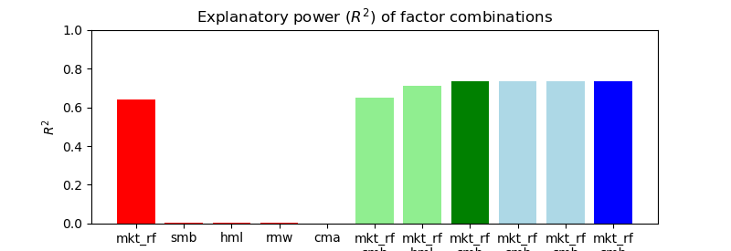
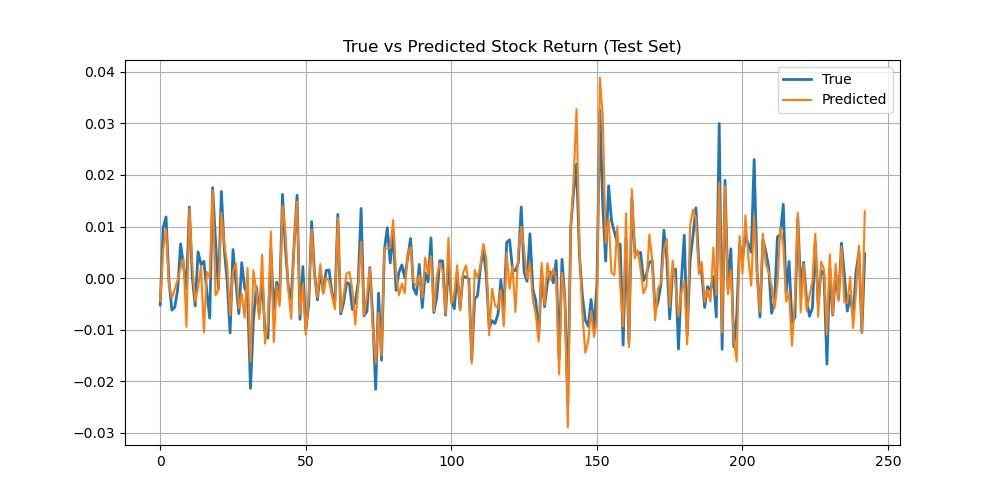
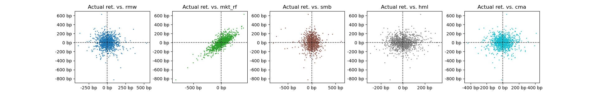

# 多因子模型 Web App

金融服务计算的多因子模型 Web App 展示，后端使用 Python Flask，前端使用简单的 HTML，部署在本地。

## 运行环境
- Python 3.8+
- Flask 
   - 使用 pip 安装即可
- pandas
- NumPy
- matplotlib
- sklearn
- tqdm

## 部署与运行
下载[历史数据文件](https://pan.sjtu.edu.cn/web/share/dc459a4381737e83f6537b5a2282de9c)（提取码：pajf）`his_sh1_201907-202406.tar.gz` 后放到 backend 目录下，执行
```bash
cd backend
tar -zxvf .\his_sh1_201907-202406.tar.gz
```
进行解压。

回到项目根目录
```bash
cd ..
```

运行 Flask 应用
```bash
python app.py
```

即可在 http://127.0.0.1:5000/ 访问 Web App。

## 功能

### 输入
- 投资组合，传到后端时应为一个 json 或字典，key 为股票代码，value 为权重，如：
```json
{
    "000002": 0.5,
    "600000": 0.3,
    "600096": 0.2
}
```
- 因子列表：从以下因子中选取并用以拟合模型
    - mkt_rf （市场风险因子）
    - smb （规模风险因子）
    - hml （账面市值比风险因子）
    - rmw （盈利能力因子）
    - cma （投资风险因子）

### 输出
1. 不同因子组合的解释力（$R^2$），柱状图。横坐标为因子组合，纵坐标为 $R^2$ 值

2. 预测的日收益率与实际的日收益率的对比，折线图。横坐标为日期，纵坐标为收益率。**展示时可以考虑给出滑动平均的选项，让曲线更清晰。**

3. 单因子与日收益率的散点图。共 5 张图（因子数量）


### 改善
- [ ] 点击“运行模型”按钮后增加动态反馈
- [ ] 前端页面美化
- [ ] （可选）因子时序序列展示